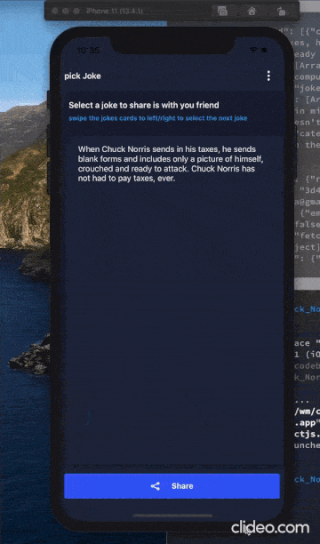

# the chuck norris react native challenge

the chuck-norris app is a cross-platform mobile app build using (react-native), is used to fetch and display jokes from the chuck-norris free API
and send a joke to friends as an email.



## install and run

```sh
git clone https://github.com/wmadfaa/the-chuck-norris-react-native-challenge.git
yarn install
cd ios && pod install && cd ..
# to run the app
yarn start
yarn ios
# or
yarn android
```

## used libraries

react-navigation -> for routing and navigation.
react-native-reanimated -> creating animation.
react-native-gesture-handler -> used as native-driven gesture management api.
react-native-ui-kitten -> ui components library.
react-redux -> state manager.
redux-saga -> for handling side effects.
redux persist ->for persisting and rehydrating the redux store.

## project structure

├── app
├── components
│   ├── BlurOverlay
│   ├── FilterOrSortModal
│   ├── FriendsList
│   ├── FriendsListItem
│   ├── Header
│   ├── SearchAnFilterBar
│   └── Swiper
├── configs
│   └── routes.ts
├── configureStore.ts
├── containers
│   ├── LayoutContainer.tsx
│   └── ScreenContainer
├── screens
│   ├── PickJoke
│   └── ShareJoke
├── store
│   ├── friends
│   ├── jokes
│   └── layout
└── utils
